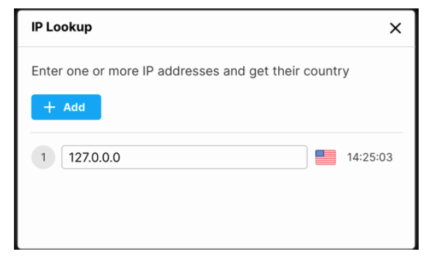

# Home Assignment

It’s your first day on the job. Everybody is super excited to have you.

There is an urgent task that has been waiting just for you.

So grab a coffee and get coding.

You are tasked with implementing a **web application that translates IP addresses into countries**.

---

## UI screenshot

## Phase 1

- The page should be based on the attached mocks.  
- The page should include an **“Add”** button that will add a new row with a label and a textbox.  
- When the textbox loses focus, perform the search.  
- You should be able to search several IPs simultaneously.

## Phase 2

- The textbox should be **disabled while searching**.  
- Provide **client‑side input validation**.  
- While searching, show a clear indication of the **operation status**.  
- Handle errors in a **friendly way**.

## Phase 3

- Once you get the location, the textbox should be **enabled again** so the user can edit and search for different IPs.  
- Show the **local time** (`hh:mm:ss`) next to the location. The time must be real‑time and continuously updated.  
- **UI/UX quality** will be taken into account, so pay close attention to these aspects.

## Bonus

- Write **unit tests** to cover your code.  
- Set up **CI/CD**.
